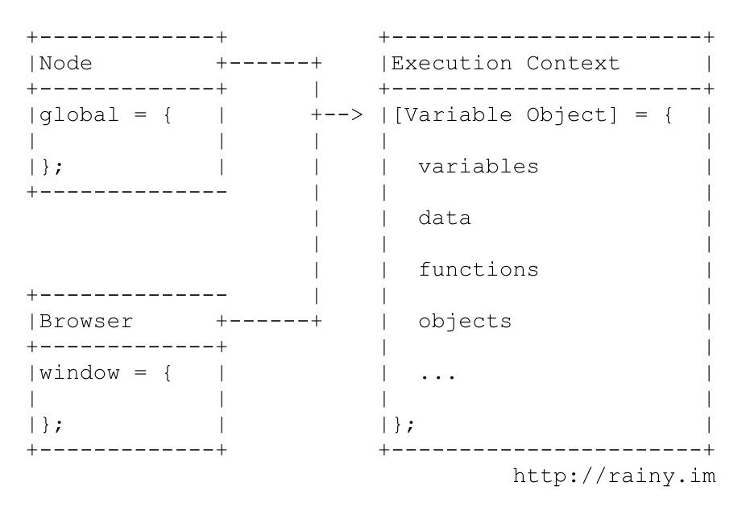
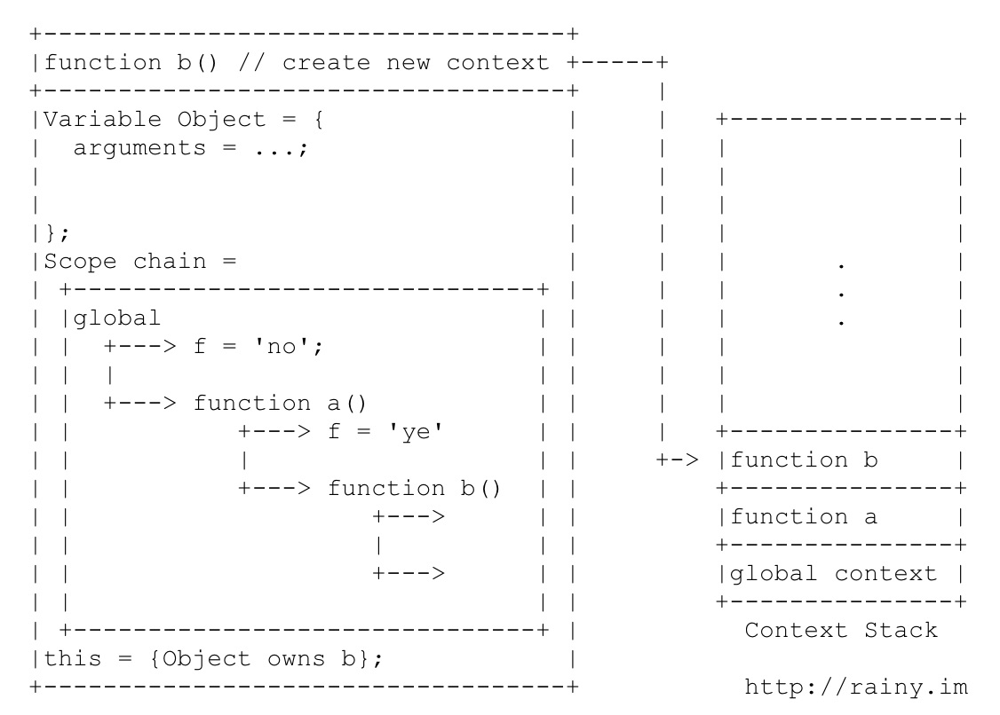
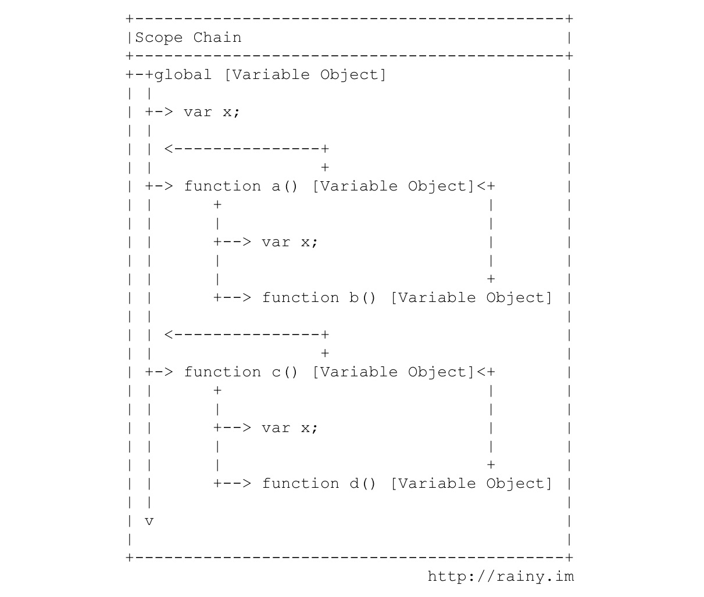

# Javascript中的this指向

* this指向
* 改变this指向：使用apply、call

## 前言

在弄清楚this指向之前，首先需要理解Javascript中的上下文与作用域背后的机制，接下来让我们一起学习执行上下文(Execution context)、作用域链（scope chain）、闭包(closure)及 this 等概念。

## Execution context

执行上下文决定了js执行过程中可以获取哪些变量、函数、数据，一段程序可能被分割成许多不同的上下文，每一个上下文都会绑定一个变量对象（variable object），它就像一个容器，用来存储当前上下文中所有已定义或可获取的变量、函数等。位于最顶端或者最外层的上下文称为全局上下文（global context），全局上下文由执行环境决定，如Node中的global,浏览器中的window.


上下文与作用域(scope)是不同的概念。js本身是单线程的，每当有function被执行，就会生成一个新的上下文， 该上下文会被压入js的上下文堆栈(context stack)中，所以js解释器总是在栈顶上下文中执行。
在生成新的上下文时：
* 首先会绑定该上下文的变量对象，其中包括arguments和该函数中定义的变量；
* 然后创建属于该上下文的作用域链(scope chain)；
* 最后将this赋予该function所属的上下文变量对象。具体过程如下图所示：


## this

上文提到this被赋予function所属的Object,具体来说，当function是定义在global中时，this指向global;当function作为Object的方法时，this指向该Object.
```javascript
var x = 1;
var f = function(){
  console.log(this.x);
}
f();  // -> 1

var ff = function(){
  this.x = 2;
  console.log(this.x);
}
ff(); // -> 2
x     // -> 2

var o = {x: "o's x", f: f};
o.f(); // "o's x"
```

## Scope chain

上文提到，在function被执行时生成新的上下文时会先绑定当前上下文的变量对象，再创建作用域链。我们知道function的定义是可以嵌套在其他function所创建的上下文中，也可以并列地定义在同一个上下文中（如global）。

作用域链实际上是将所有嵌套定义的上下文所绑定的变量对象串接在一起，使嵌套的function可以继承上层上下文的变量，而并列的function之间互不干扰。



```javascript
var x = 'global';
function a(){
  var x = "a's x";
  function b(){
    var y = "b's y";
    console.log(x);
  };
  b();
}
function c(){
  var x = "c's x";
  function d(){
    console.log(y);
  };
  d();
}
a();  // -> "a's x"
c();  // -> ReferenceError: y is not defined
x     // -> "global"
y     // -> ReferenceError: y is not defined
```

## Closure

如果理解了上文中提到的上下文与作用域链的机制，再来看闭包的概念就很清楚了。每个function在调用时会创建新的上下文及作用域链，而作用域链就是将外层（上层）上下文所绑定的变量对象逐一串连起来，使当前function可以获取外层上下文的变量、数据等。如果我们在function中定义新的function，同时将内层function作为值返回，那么内层function所包含的作用域链将会一起返回，即使内层function在其他上下文中执行，其内部的作用域链仍然保持着原有的数据，而当前的上下文可能无法获取原先外层function中的数据，使得function内部的作用域链被保护起来，从而形成“闭包”。看下面的例子：

```javascript
var x = 100;
var inc = function(){
  var x = 0;
  return function(){
    console.log(x++);
  };
};

var inc1 = inc();
var inc2 = inc();

inc1();  // -> 0
inc1();  // -> 1
inc2();  // -> 0
inc1();  // -> 2
inc2();  // -> 1
x;       // -> 100
```

## Reference

http://blog.rainy.im/2015/07/04/scope-chain-and-prototype-chain-in-js/